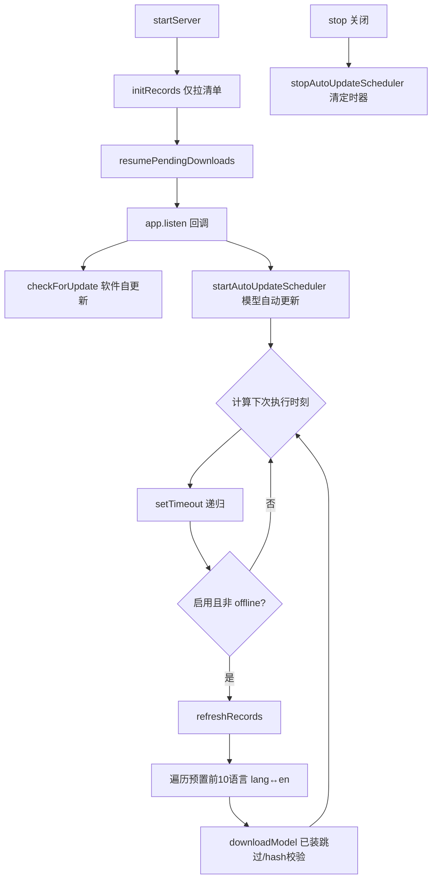

## 用户需求

为 MTranServer 增加"模型自动更新"机制，让服务在运行期间按配置定时拉取 Mozilla 模型库最新 records 并下载预置常用语言的模型，避免手动刷新。

## 产品概述

在现有单进程离线翻译服务基础上，新增一个后台定时调度器。它在服务启动完成后的指定时刻，周期性地刷新模型清单并下载"排名前10的常用语言"对应模型（英语枢纽架构下即各语言与 en 的配对），全程不阻塞主服务、不影响启动速度。

## 核心功能

- 环境变量配置自动更新的基准整点小时（0-23），默认在该整点的第12分钟执行首次。
- 环境变量配置每天自动更新检查次数（相邻两次间隔不小于1小时，上限24次/天），按次数在全天均匀分摊执行时刻。
- 自动更新仅覆盖内置预置的前10常用语言（默认如 zh, en, ja, ko, ru, fr, de, es, pt, ar），可调。
- 服务启动阶段不触发任何模型下载/更新，定时器仅在 listen 成功后挂起。
- 与 offline 模式互斥：offline 下自动更新静默跳过。
- 代码评审保证逻辑完整、前后端对接无遗漏，并实现文档同步更新。

## 技术栈

- 沿用现有栈：TypeScript + bun 运行时 + Express 服务，配置系统（`getString/getBool/getInt`）、模型管理层（`records.ts`/`manager.ts`）、日志（`@/logger`）。
- 不引入新依赖，定时器用 Node 原生 `setTimeout` 递归调度（避免 `setInterval` 漂移，且与现有 engine 空闲 `setTimeout` 风格一致）。

## 实现方案

### 策略

新增独立调度模块 `src/models/auto-update.ts`，在 `startServer` 的 `app.listen` 回调内启动（与 `checkForUpdate` 同位置），在 `stop()` 内清理。每次触发：校验 offline/启用开关 → `refreshRecords()` → 遍历预置前10语言，对每个语言与 en 的双向配对调用 `downloadModel`（已装自动跳过、hash 校验）。

### 关键技术决策

1. **递归 setTimeout 而非 setInterval**：避免任务执行耗时导致的间隔漂移；每次执行后计算"下次执行时刻"再 setTimeout，调度精确且可随时停止。
2. **仅下载预置语言与 en 的配对**：Mozilla 库是英语枢纽，非 en 配对不存在；对每个预置语言只尝试 `lang↔en` 两个方向，`downloadModel` 内部已对缺失/已装做跳过处理。
3. **启动不下载**：`initRecords()`（仅拉清单）与 `resumePendingDownloads()` 保持不变；调度器在 listen 回调启动，绝不在启动关键路径内。
4. **失败隔离**：单次刷新或某语言下载失败仅记日志，不中断其他语言与其他周期；refresh 失败则跳过本次下载。
5. **offline 互斥**：`refreshRecords()` 在 offline 下抛错，调度器捕获后静默跳过并正常排期下次。
6. **并发安全**：与手动 `/api/models/refresh`、`/api/models/download` 共享 `globalRecords`；刷新为整体替换、下载为只读选择+写文件，短窗口竞态风险低，沿用现有 `downloadModel` 的幂等设计（hash 校验跳过已装）即可，不额外加锁以免引入死锁。

### 性能与可靠性

- 每日最多24次、且只下载10个语言×2方向的增量（已装跳过），带宽/磁盘开销可控。
- 调度计算为 O(1)，无热路径；下载复用现有下载器与进度/回退逻辑。
- 日志沿用 `logger`，记录每次触发结果（成功/跳过/失败原因），不打印大 payload。

## 实现注意事项

- 复用 `getConfig()`、`refreshRecords()`、`downloadModel(toLang, fromLang)`、`getModelSelection` 既有能力，不重复实现。
- 递归 setTimeout 必须保存 timer handle 供 `stop()` 清理，防止服务关闭后仍在跑。
- 环境变量命名统一 `MT_` 前缀，沿用 `getInt/getBool/getString` 的 (flag, envKey, default) 签名，保证命令行/文件/环境变量三源一致。
- 预置语言列表集中定义为常量并注释可调，避免散落硬编码。
- 严格保持现有 `checkUpdate`（软件自更新）与新增"模型自动更新"语义分离，不混淆。

## 架构设计



## 目录结构

```
src/
├── config/index.ts              # [MODIFY] Config 接口新增 autoUpdateHour/autoUpdateTimesPerDay/autoUpdateEnabled/autoUpdateLanguages 字段；getConfig 内用 getInt/getBool/getString 注入，默认值：hour=3、timesPerDay=1、enabled=true、languages=预置列表
├── models/
│   ├── auto-update.ts           # [NEW] 自动更新调度器。导出 startAutoUpdateScheduler()/stopAutoUpdateScheduler()；内置预置前10语言常量 PRESET_TOP_LANGUAGES；实现"基准整点+第12分、按次数均匀分摊"的下次时刻计算；每次触发刷新 records 并对预置语言↔en 调 downloadModel，失败隔离+日志。
│   └── records.ts               # [不动] 复用 refreshRecords/downloadModel，无需改动
├── server/index.ts              # [MODIFY] 在 app.listen 回调内（与 checkForUpdate 并列）调用 startAutoUpdateScheduler()；在 stop() 内调用 stopAutoUpdateScheduler()
└── models/manager.ts            # [不动] 复用 refreshModelRecords/startModelDownload
ui/
└── src/components/ModelManagerDialog.tsx  # [评审确认] 现有 refresh/download 对接已完整，本功能后端静默执行，前端暂不改；若评审发现需暴露状态再补充
docs/
└── model-auto-update.md         # [NEW] 自动更新说明文档：环境变量名/默认值/取值约束、预置语言列表、定时示例（A=3,B=4→3:12/9:12/15:12/21:12）、与 offline 模式互斥、运维注意
```

## 关键代码结构（配置项）

```ts
// src/config/index.ts 新增 Config 字段
autoUpdateEnabled: boolean;      // MT_AUTO_UPDATE_ENABLED，默认 true
autoUpdateHour: number;          // MT_AUTO_UPDATE_HOUR，0-23，默认 3（首个执行整点）
autoUpdateMinute: number;        // 固定第12分钟，常量，不暴露
autoUpdateTimesPerDay: number;   // MT_AUTO_UPDATE_TIMES_PER_DAY，1-24，默认 1
autoUpdateLanguages: string[];   // MT_AUTO_UPDATE_LANGUAGES，逗号分隔，默认预置前10
```